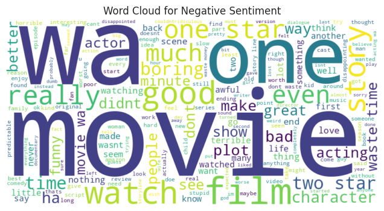

# Amazon Prime Viewers’ Sentiment Analysis

## Table of Contents
- [Amazon Prime Viewers’ Sentiment Analysis](#amazon-prime-viewers-sentiment-analysis)
  - [Table of Contents](#table-of-contents)
  - [About The Project](#about-the-project)
    - [Overview](#overview)
  - [Built With](#built-with)
  - [Getting Started](#getting-started)
    - [Prerequisites](#prerequisites)
    - [Installation](#installation)
    - [Usage](#usage)
  - [Dataset Information](#dataset-information)
    - [Data Source](#data-source)
    - [Dataset Details](#dataset-details)
    - [Key Features](#key-features)
    - [Preprocessing Steps](#preprocessing-steps)
  - [Methodology](#methodology)
    - [Baseline Models](#baseline-models)
    - [Advanced Models](#advanced-models)
    - [Target Variable](#target-variable)
    - [Evaluation Metrics](#evaluation-metrics)
  - [Results \& Insights](#results--insights)
  - [Visualization Strategy](#visualization-strategy)
  - [Deployment Plan](#deployment-plan)
    - [Deliverables](#deliverables)
    - [Web App (Stretch Goal)](#web-app-stretch-goal)
    - [API (Stretch Goal)](#api-stretch-goal)
  - [Tools \& Technologies Used](#tools--technologies-used)
    - [Libraries](#libraries)
  - [How to Run the Project](#how-to-run-the-project)
    - [Run Baseline Models](#run-baseline-models)
    - [Run Advanced Model(BERT)](#run-advanced-modelbert)
    - [Run Web App (if implemented)](#run-web-app-if-implemented)
  - [Future Enhancements](#future-enhancements)
  - [Contributors](#contributors)
  - [Contact](#contact)
  - [Acknowledgments](#acknowledgments)

## About The Project
### Overview
This project aims to analyze Amazon Prime Video ratings and reviews to understand customer sentiment, identify trends in viewer preferences, and determine factors influencing high or low ratings. The insights will help improve recommendations, optimize content offerings, and enhance user satisfaction.

## Built With
- **Programming Language:** Python
- **Libraries:** `pandas`, `numpy`, `nltk`, `sklearn`, `seaborn`, `matplotlib`, `wordcloud`, `spacy`, `transformers`, `torch`
- **Development Environment:** Google Colab, Local Machine

## Getting Started
### Prerequisites
Before running this project, ensure you have:
- Python 3.8+
- Jupyter Notebook or Google Colab
- Required Python libraries installed:
  ```bash
  pip install pandas numpy matplotlib seaborn nltk spacy transformers torch scikit-learn
  ```

### Installation
1. Clone the repository:
   ```sh
   git clone https://github.com/your-repo/sentiment-analysis.git
   ```
2. Navigate to the project directory:
   ```sh
   #cd sentiment-analysis
   ```
3. Install dependencies:
   ```sh
   #pip install -r requirements.txt
   ```

### Usage
- Run the Jupyter Notebook or Google Colab file to explore the dataset and train models.
- Modify parameters and experiment with different models.
- Save trained models using `joblib` for deployment.

## Dataset Information
### Data Source
The dataset is sourced from [McAuley Lab’s Amazon Reviews Dataset (2023)](https://amazon-reviews-2023.github.io/). It includes:
- *User Reviews*: Ratings, text, helpfulness votes
- *Item Metadata*: Descriptions, price, category, images
- *Links*: User-item relations

### Dataset Details
- Extracted *233,000* Amazon Prime Video reviews
- Merged User Reviews and Item Metadata using parent_asin
- Filtered out non-Prime Video reviews

### Key Features
- **Review Text** – User-written review content
- **Star Rating** – Numeric rating (1-5)
- **Timestamp** – Review date/time
- **Product Metadata** – Movie/TV title, genre, release year
- **User Metadata** – Verified purchase status, review count

### Preprocessing Steps
- Handling missing values & duplicates
- Removing stopwords, special characters, punctuation
- Tokenization, lemmatization, vectorization (TF-IDF, embeddings)
- Addressing class imbalance in sentiment labels

## Methodology
### Baseline Models
- *Multinomial Naïve Bayes (NB)* – Fast and efficient for text classification
- *Support Vector Machines (SVM)* – Handles high-dimensional text data

### Advanced Models
- *LSTM & BiLSTM (RNNs)* – Captures sequential text dependencies
- *BERT Transformers* – State-of-the-art NLP model for contextual understanding

### Target Variable
- *Sentiment Classification*:
  - *Positive* (4-5 stars)
  - *Neutral* (3 stars)
  - *Negative* (1-2 stars)

### Evaluation Metrics
- **Accuracy** – Overall model correctness
- **Precision, Recall, F1-Score** – Performance across sentiment classes
- **Confusion Matrix** – Misclassification visualization

## Results & Insights
- Sentiment trends over time
- Most frequent keywords in positive vs. negative reviews
- Correlation between genre and sentiment
- Effectiveness of traditional ML vs. deep learning models

## Visualization Strategy 
- **Word Clouds** – Common themes in positive neutral & negative reviews



- **Bar Charts & Histograms** – Rating distributions, sentiment trends

- **Time-Series Analysis** – Sentiment shifts over time


## Deployment Plan
### Deliverables
- Jupyter Notebook with EDA, modeling, and evaluation
- PowerPoint summary of key insights

### Web App (Stretch Goal)
- Built using Flask, Streamlit, or Dash
- Interactive visualization of sentiment trends
- Review-based sentiment analysis

### API (Stretch Goal)
- Flask/Django API for sentiment prediction
- Accepts user reviews and returns sentiment label

## Tools & Technologies Used
### Libraries
- **Data Processing**: pandas, numpy
- **Visualization**: matplotlib, seaborn, wordcloud
- **NLP & Feature Engineering**: NLTK, spaCy, TF-IDF, Word2Vec
- **Machine Learning**: scikit-learn (NB, SVM), XGBoost, Random Forest
- **Deep Learning**: TensorFlow, Keras, transformers (Hugging Face BERT)

## How to Run the Project
### Run Baseline Models
```python
python svm_model.py
```

### Run Advanced Model(BERT)
```python
python bert_model.py
```

### Run Web App (if implemented)
```bash
streamlit run app.py
```

## Future Enhancements
✅ Optimize hyperparameters for ML & DL models  
✅ Implement real-time sentiment analysis API  
✅ Integrate with IMDb or external sources for richer data  
✅ Build a recommendation system based on sentiment trends  

## Contributors
- **Team Members:** (List names)
- **Mentor:** (If applicable)
- **Contact:** (GitHub repo)


## Contact
- Your Name - Group 1 Capstone project
- Project Link: [GitHub Repository](https://github.com/WambuiMunene/Group_1_Capstone_Project)

## Acknowledgments
- Open-source datasets from Amazon Prime
- Python community for excellent libraries
- Online NLP and ML courses for guidance